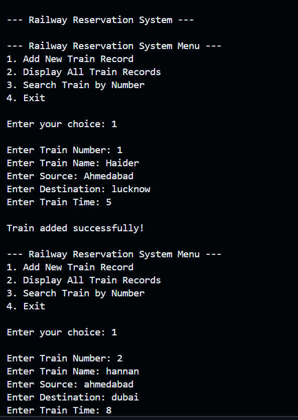
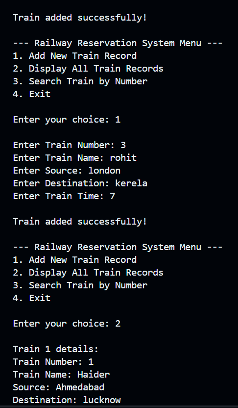

# 🚆 Railway Reservation System (C++ Project)

This is a simple **menu-driven Railway Reservation System** built using **Object-Oriented Programming (OOP) in C++**.  
The project demonstrates concepts like:

- Classes & Objects  
- Constructors & Destructors  
- Static Data Members  
- Encapsulation  
- Array of Objects  
- Menu-driven System  
- Searching & Displaying Records  

---

## 📌 Features

### ✔ Add New Train  
User can enter:
- Train Number  
- Train Name  
- Source  
- Destination  
- Train Time  

### ✔ Display All Trains  
Prints details of all trains stored in the system.

### ✔ Search Train  
Users can search train details using **Train Number**.

### ✔ Static Train Counter  
Tracks the total number of trains added.

---

## Output Images :-

