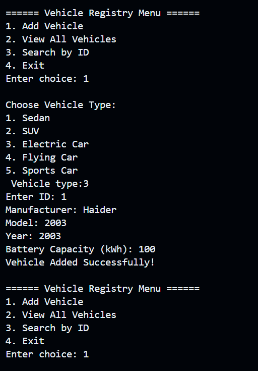
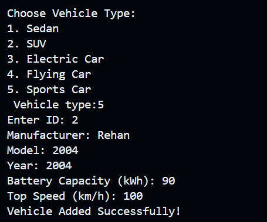

# 🚗 Vehicle Registry System (C++)

A simple menu-driven project made using **C++ OOP Concepts** to manage different types of vehicles.

---

## 📘 Concepts Used
- 🔹 Classes & Objects  
- 🔹 Encapsulation  
- 🔹 Getters & Setters  
- 🔹 Constructors & Destructor  
- 🔹 Static Member  
- 🔹 Array of Objects (Pointers)  
- 🔹 Single Inheritance  
- 🔹 Multilevel Inheritance  
- 🔹 Multiple Inheritance  
- 🔹 Hierarchical Inheritance  

---

## 🚘 Vehicle Types Included
- 🚗 Sedan  
- 🚙 SUV  
- 🔋 Electric Car  
- ✈️ Flying Car  
- 🏎 Sports Car  

---

## ⚙️ Features
- ➕ Add Vehicle  
- 📄 View All Vehicles  
- 🔍 Search by ID  
- 🧩 Stores mixed vehicle types  
- 🖥 Uses virtual functions for display  

---

## ▶️ How to Run

```
g++ main.cpp -o vehicle
./vehicle

```

---

## 📸 Output Images

### Adding Vehicle 



### View All Vehicles


### Search by ID


