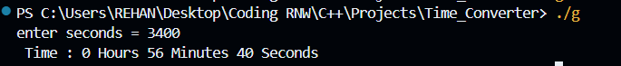
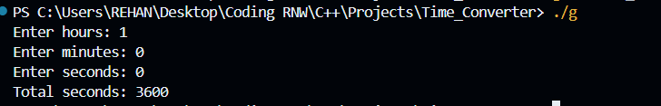

# 🕒 Time Conversion Programs (C++)

This repository contains **two simple C++ programs** for converting time between **seconds** and **hours-minutes-seconds** formats.

---

## 📘 Program 1: Convert Seconds → Hours : Minutes : Seconds

### 📄 File Name
`seconds_to_hms.cpp`

### 🧠 Description
This program takes **total seconds** as input and converts them into **hours**, **minutes**, and **seconds**.

### 🧩 Code Logic
1. User inputs total seconds.
2. Program divides seconds into:
   - Hours = `seconds / 3600`
   - Minutes = `(seconds % 3600) / 60`
   - Remaining Seconds = `seconds % 60`
3. Displays the converted time.

### ▶️ Sample Output Images

---

## 📗 Program 2: Convert Hours : Minutes : Seconds → Total Seconds

### 📄 File Name
`hms_to_seconds.cpp`

### 🧠 Description
This program takes **hours, minutes, and seconds** as input and converts them into **total seconds**.

### 🧩 Code Logic
1. User inputs hours, minutes, and seconds.
2. Program calculates:
   - `totalSeconds = (hours * 3600) + (minutes * 60) + seconds`
3. Displays total seconds.

### ▶️ Sample Output Images
